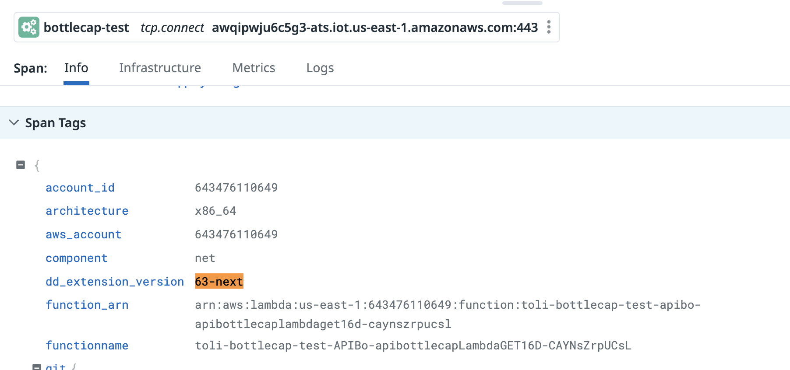
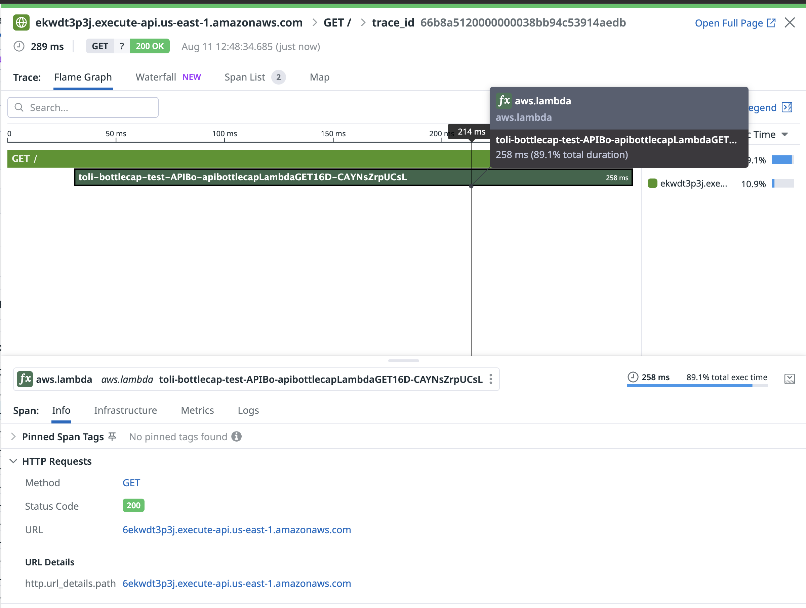
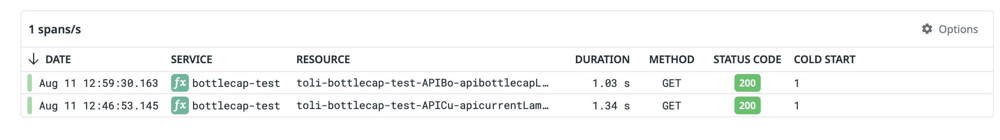
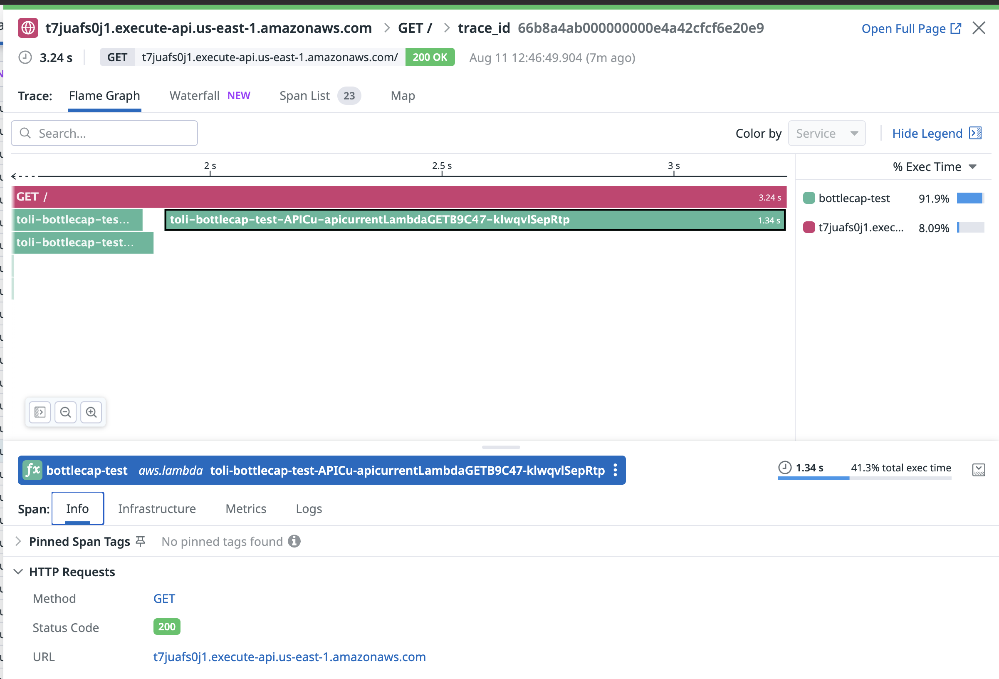
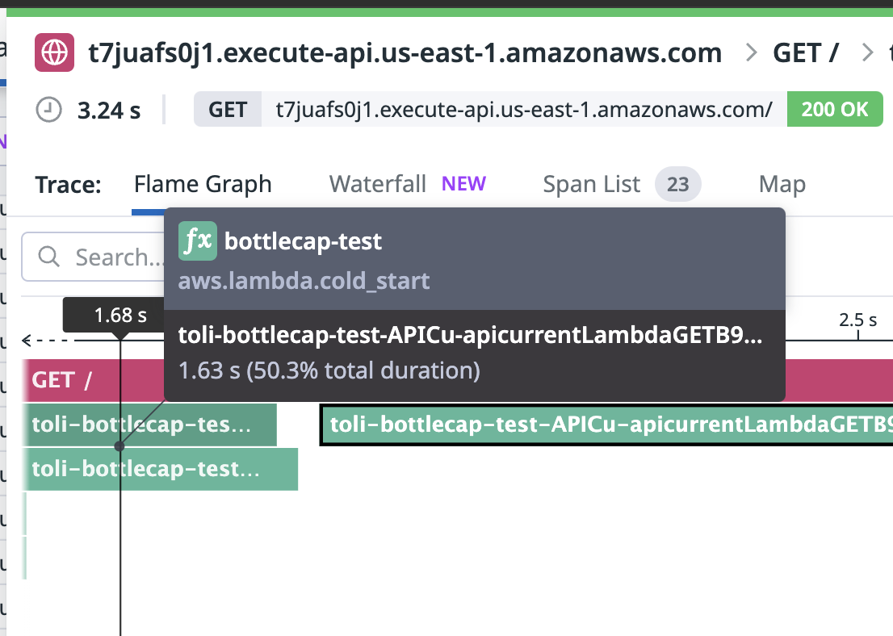
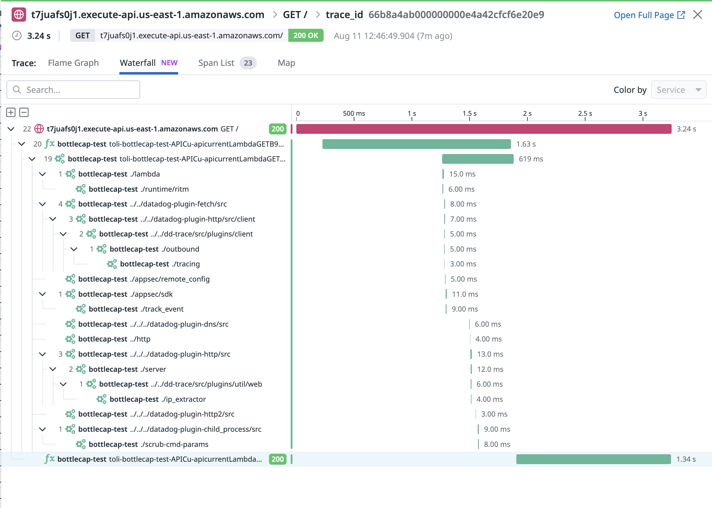
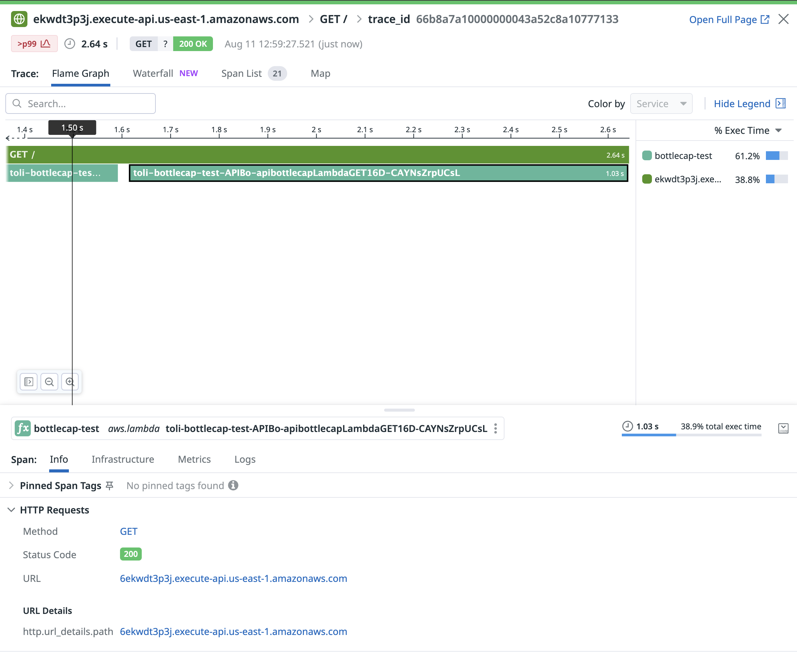
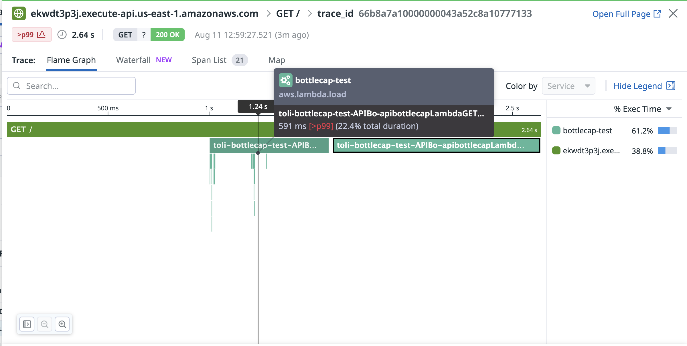
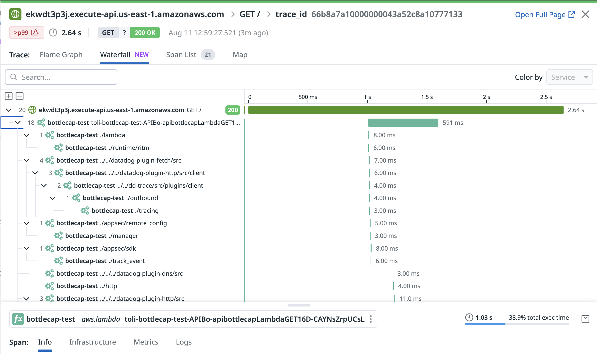

# sst-aws-lambda-bottlecap

This is a simple app that is testing the performance of a beta release of a new Datadog extension (this is August 2024!). 

## Configuration

dd_extension_version: 63-next
architecture: x86_64

## Spot testing

### Current extension

1.34s execution ofr Lambda function
3.24s total execution (including cold start)

Cold start: 1.63s

There seem to be two spans: `aws.lambda.cold_start` and `aws.lambda.load`.

There seems to be almost one second of waiting time?

### New extension

1.03s execution ofr Lambda function
2.64s total execution (including cold start)

Cold start: 591ms?

There seem to be only one span for `aws.lambda.load`, and  `aws.lambda.cold_start` is not present.

